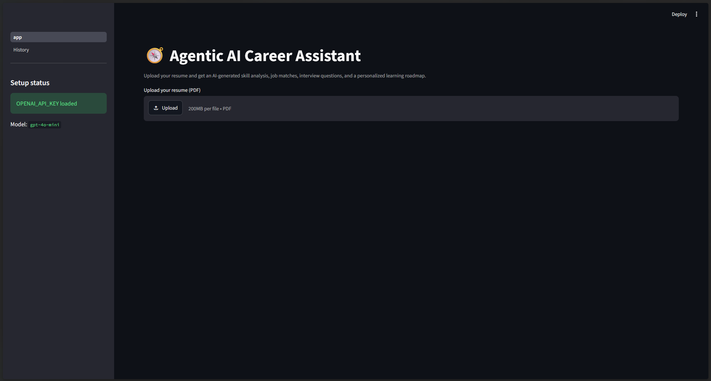
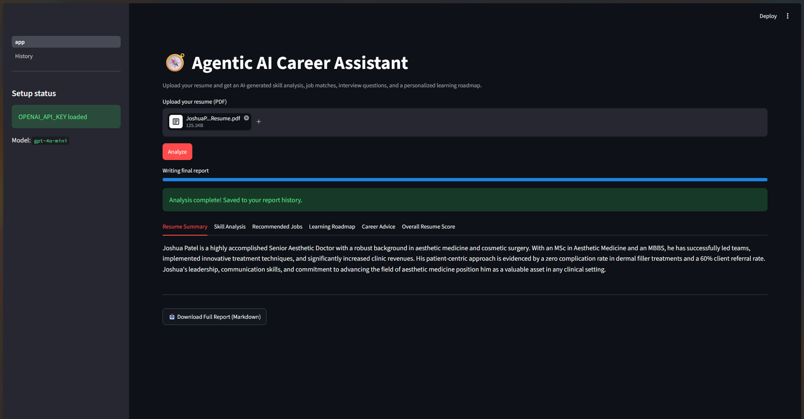
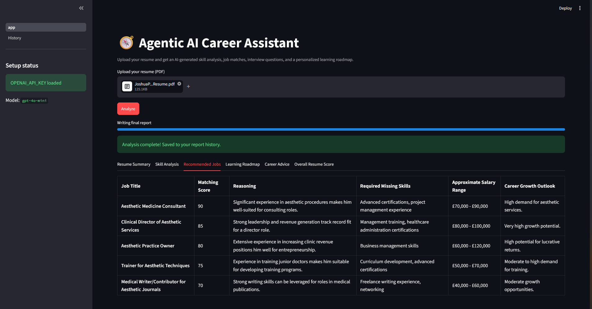
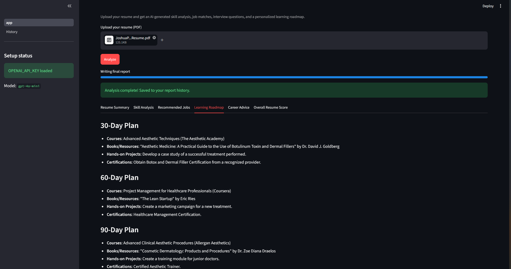
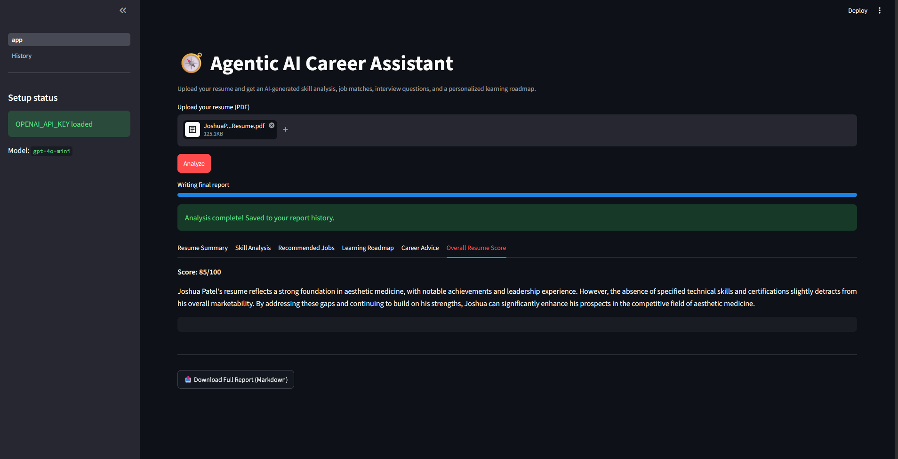

# 🧭 Career AI Assistant

A production-grade, multi-agent career analysis system built with **CrewAI** and **OpenAI GPT-4**. Upload a resume PDF and get an automated skill analysis, job recommendations, personalized interview questions, a 30/60/90-day learning roadmap, and a polished Markdown career report — all through a Streamlit UI, with report history persisted in a local database.

🔗 **[Live Demo](#)** ← replace with your Streamlit Cloud URL once deployed

## Demo

**Upload screen:**



**Resume summary, generated from the uploaded PDF:**



**Recommended jobs** — genuinely field-adaptive: this candidate's resume is for a Senior Aesthetic Doctor, and the Job Matching Agent correctly recommends *Aesthetic Medicine Consultant*, *Clinical Director of Aesthetic Services*, and similar roles - not generic tech titles:



**Personalized 30/60/90-day learning roadmap:**



**Overall resume score with justification:**



## Architecture

Six specialized agents run as a sequential CrewAI pipeline, each depending on the outputs of the ones before it:

```
Resume PDF
   │
   ▼
Resume Analysis Agent      → structured resume summary
   │
   ▼
Skill Analysis Agent        → strengths, weaknesses, missing skills
   │
   ▼
Job Matching Agent          → ranked job recommendations
   │
   ▼
Interview Preparation Agent → tailored interview questions
   │
   ▼
Learning Roadmap Agent      → 30/60/90-day plan
   │
   ▼
Career Report Writer Agent  → career_report.md
```

Every agent adapts to the candidate's actual field rather than assuming a technical background — a non-technical resume gets non-technical job recommendations, skill categories, and interview questions (see the screenshots above).

Once generated, each report is automatically saved to a local SQLite database and browsable from the **History** page.

## Project structure

```
career-ai-assistant/
├── agents/              # One CrewAI Agent definition per file
├── tasks/               # One CrewAI Task definition per agent, wired with context
├── tools/                # PDFSearchTool wrapper + raw text extraction
├── database/             # SQLAlchemy models, session setup, and CRUD functions
├── pages/                # Streamlit multi-page app - History page
├── docs/screenshots/      # README screenshots
├── data/                 # Scratch space for uploaded resumes (gitignored)
├── reports/              # Generated career_report.md files (gitignored)
├── tests/                # Pytest unit tests
├── app.py                 # Streamlit UI (main page)
├── crew.py                # Crew orchestration (wires agents + tasks together, saves to DB)
├── config.py              # Centralized environment-variable configuration
├── requirements.txt
├── .env.example
└── README.md
```

## Setup

### 1. Clone and install

```bash
git clone <your-repo-url>
cd career-ai-assistant
python -m venv venv
source venv/bin/activate   # On Windows: venv\Scripts\activate
pip install -r requirements.txt
```

### 2. Configure environment variables

```bash
cp .env.example .env
```

Edit `.env` and set your OpenAI API key:

```
OPENAI_API_KEY=sk-...
OPENAI_MODEL_NAME=gpt-4o-mini
CREWAI_TOOLS_ALLOW_UNSAFE_PATHS=true
```

`gpt-4o-mini` is used by default - it comfortably fits typical account rate limits for this multi-agent pipeline while being significantly cheaper. Swap in `gpt-4o` once your OpenAI account's usage tier supports it, if you want to compare quality.

### 3. Run the app

```bash
streamlit run app.py
```

Open the local URL Streamlit prints (typically `http://localhost:8501`), upload a resume PDF, and click **Analyze**. Past reports are saved automatically and browsable from the **History** page in the sidebar.

## Deployment (Streamlit Community Cloud)

This app can be deployed for free at [share.streamlit.io](https://share.streamlit.io):

1. Push this repo to GitHub (make sure `.env` is **not** committed - it's already gitignored).
2. Go to share.streamlit.io, sign in with GitHub, and click "New app".
3. Select this repo, branch `main`, and set the main file path to `app.py`.
4. Before deploying, click **"Advanced settings" → "Secrets"** and paste your environment variables in TOML format:
   ```toml
   OPENAI_API_KEY = "sk-proj-your-key-here"
   OPENAI_MODEL_NAME = "gpt-4o-mini"
   LLM_TEMPERATURE = "0.3"
   MAX_RESUME_FILE_MB = "10"
   REPORT_FILENAME = "career_report.md"
   CREWAI_TOOLS_ALLOW_UNSAFE_PATHS = "true"
   ```
   Streamlit Cloud injects these as environment variables at runtime - `config.py`'s `load_dotenv()` + `os.getenv()` calls pick them up exactly the same way they do locally.
5. Click **Deploy**. First build takes a few minutes (installing crewai's dependency tree).

**Important limitation to know about:** Streamlit Community Cloud's filesystem is ephemeral - the SQLite database (`career_assistant.db`) and any uploaded resumes will be wiped whenever the app restarts or redeploys (e.g. after inactivity, or a new git push). This is fine for demo purposes but isn't real persistent storage. If you want the History feature to survive restarts in production, the next step would be swapping SQLite for a hosted database (e.g. free tier of Supabase or Neon Postgres) - the code is already written against plain SQLAlchemy, so only `DATABASE_URL` in `database/db.py` would need to change.

## Running tests

```bash
pytest tests/ -v
```

The included tests exercise the PDF-parsing utilities without requiring an API key or network access. For agent-level testing, mock the `LLM` and `PDFSearchTool` objects to avoid live API calls in CI.

## Design principles

- **Single Responsibility** — each agent and task lives in its own file with one clear job.
- **No hardcoded values** — every credential, model name, and path comes from `config.py`, which reads environment variables.
- **Field-adaptive analysis** — agents identify the candidate's actual professional field before recommending jobs, skill categories, or interview topics, rather than defaulting to tech/AI roles for every resume.
- **Deterministic fallback** — resume text is extracted with `pypdf` directly (not just RAG search) so the pipeline always has ground-truth text, even if semantic search misses a detail.
- **Exception handling** — the UI layer (`app.py`) catches and surfaces file, config, and pipeline errors distinctly rather than crashing.
- **Persistence with a clear boundary** — SQLAlchemy models, session handling, and CRUD functions are each in their own module (`database/models.py`, `database/db.py`, `database/crud.py`), so swapping SQLite for Postgres later touches only one file.
- **Extensibility** — swapping in a different LLM provider only requires changing `config.py` and the `LLM(...)` instantiation in `agents/__init__.py`.

## Extending this project

- Add a new agent by creating a file in `agents/`, registering it in `agents/__init__.py`, and adding a matching task in `tasks/`.
- Add skill-radar or bar charts to the Streamlit UI using `matplotlib` or `plotly` fed from the Skill Analysis Agent's output.
- Swap `PDFSearchTool`'s embedder/LLM config in `tools/pdf_tool.py` to use a different provider (e.g. a local embedding model) without touching any other file.
- Swap SQLite for PostgreSQL by changing `DATABASE_URL` in `database/db.py` — useful if deploying somewhere with persistent storage.
- Add authentication (e.g. `streamlit-authenticator`) and a `user_id` column on `resumes`/`reports` to support multiple users, each seeing only their own history.

## License

MIT — use freely for portfolio or production purposes.
